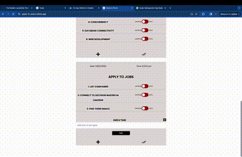
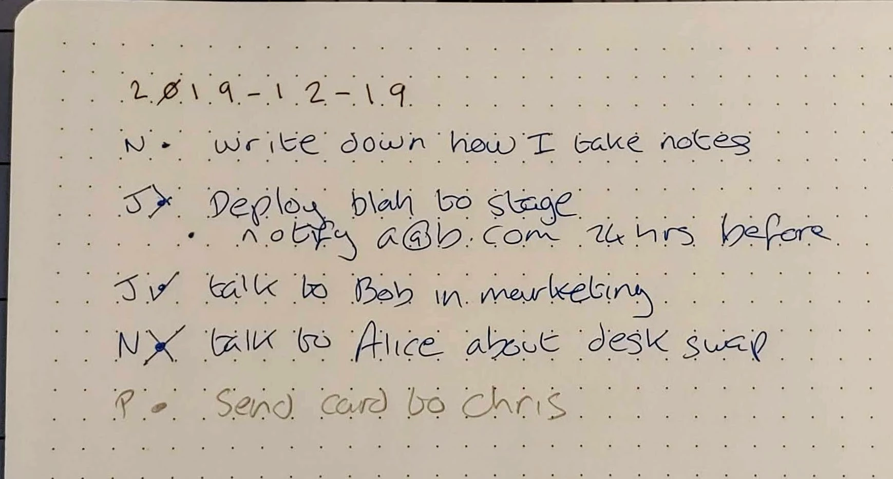

# GoalsToScore - A task management app

[Try here](https://goals-to-score.netlify.app/)


## Overview

GoalsToScore is A MERN stack app for effective goals management, allowing for creation and updates of goals and sub-tasks. The app requires a simple authentication, and allows a user to save their goals with tasks related to them. They can later add more tasks as needed and switch the status of each task to either pending or completed which updates in the backend synchronously.

[](https://goals-to-score.netlify.app/)
<br>
<br>
[Live Demo](https://youtu.be/aAT7HKS-DdU)
<br>
<br>
[](https://youtu.be/aAT7HKS-DdU "Goals-To-Score")


## Features

1. **Sign Up:** Signup with your email to register and login for personalised experience.

2. **Creaate Goals:** Create a major goal that you want to accomplish..

3. **Create Tasks:** Create sub goals or tasks to assign to goals.

4. **Toggle Tasks:** Toggle between pending and completed for the tasks.

5. **Add tasks later and delete:** Add tasks later on the go, and delete the whole goal once accomplished.


## Technologies Used

- **React.js:** The front-end is built using React.js, providing a dynamic and responsive user interface.

- **Node.js:** Express.js and MongoDb is used for authentication and storage, ensuring a secure and scalable solution.

- **React Hooks and Contexts:** State management in GoalsToScore is handled efficiently with React Hooks and Contexts, providing a seamless user experience.


## Getting Started

1. **Clone the Repository:**
   ```bash
   git clone https://github.com/AjayGhimire1998/goals-to-score.git


2. **Install Dependencies:**
   ```bash
   cd memebook
   npm install
   

4. **Run the App:**
   ```bash
   npm start

   
5. **Access MemeBook:**
   Open your browser and navigate to http://localhost:3000 to use GoalsToScore locally.


## Contributing

I welcome contributions to make GoalsToScore even more entertaining and user-friendly. Feel free to submit issues, feature requests, or pull requests.

## License

This project is licensed under the MIT License.

## Acknowledgments

Thanks to the developers of React.js, Redux.js, Express.js, MongoDB, for providing valuable content and tools.


# Enjoy GoalsToScore and happy-productivity! 🎉


